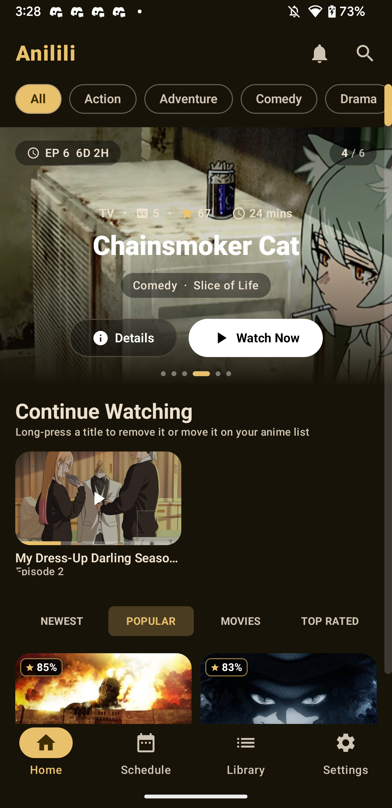
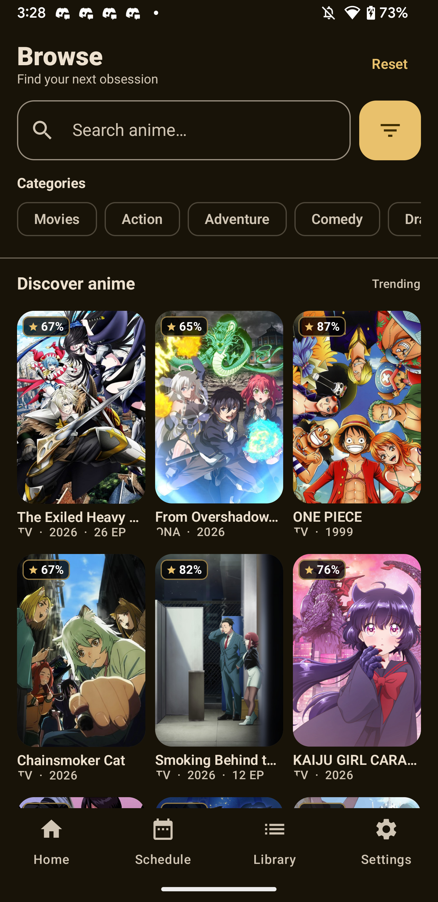
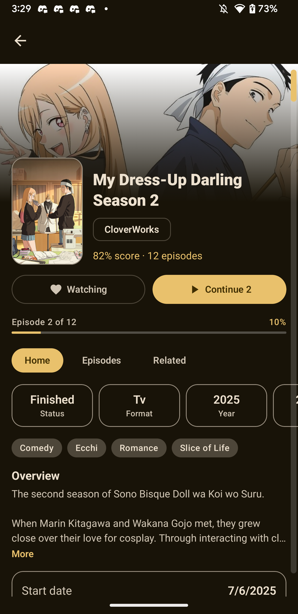

<p align="center">
  
</p>

<h1 align="center">Anila</h1>

<p align="center">
  <strong>Anime, beautifully native on Android.</strong><br />
  Fast multi-source playback, offline downloads, AniList/MAL sync, and a remote-first TV experience.
</p>

<p align="center">
  <a href="https://github.com/wollydev24/Anila/releases/latest/download/Anila.apk">
    
  </a>
</p>

<p align="center">
  <a href="https://github.com/wollydev24/Anila/releases/latest"></a>
  <a href="https://github.com/wollydev24/Anila/releases"></a>
  
  
  
</p>

<p align="center">
  <a href="https://wollydev24.github.io/Anila/">Website</a> ·
  <a href="https://github.com/wollydev24/Anila/releases">All releases</a> ·
  <a href="https://github.com/wollydev24/Anila/issues">Report a problem</a>
</p>

---

## Made for every Android screen

Anila is a native Kotlin and Jetpack Compose anime client for phones, tablets, Android TV,
and Fire TV. It combines discovery, streaming, downloads, list management, and progress sync
in one adaptive interface—without wrapping the whole experience in a website.

| Watch your way | Your anime, in sync | Built for the couch |
| --- | --- | --- |
| Native Media3 playback, multiple sources, subtitles, skip intro/outro, quality selection, PiP, casting controls, and offline episodes. | Sign in with AniList or MyAnimeList, update your list from the player, resume episodes, and optionally sync watched progress. | Large-screen layouts, D-pad navigation, visible focus states, TV-safe spacing, and player controls designed for a remote. |

## Mobile experience

<table>
  <tr>
    <th width="33%">Home &amp; continue watching</th>
    <th width="33%">Discover &amp; filter</th>
    <th width="33%">Details &amp; airing info</th>
  </tr>
  <tr>
    <td><a href="showcase/mobile/home.png"></a></td>
    <td><a href="showcase/mobile/discover.png"></a></td>
    <td><a href="showcase/mobile/detailed.png"></a></td>
  </tr>
</table>

<p align="center">
  <strong>Native player with episodes, captions, casting, fullscreen, and list controls</strong><br /><br />
  <a href="showcase/mobile/player.webp"></a>
</p>

## TV experience

<table>
  <tr>
    <th width="50%">A cinematic, remote-friendly home</th>
    <th width="50%">Details and episodes side by side</th>
  </tr>
  <tr>
    <td><a href="showcase/tv/home.webp"></a></td>
    <td><a href="showcase/tv/details.webp"></a></td>
  </tr>
</table>

<p align="center">
  <strong>Fullscreen playback designed around D-pad controls</strong><br /><br />
  <a href="showcase/tv/player.webp"></a>
</p>

## Highlights

- **Multiple streaming sources:** automatic discovery and fallback across Miruro and
  Anivexa-backed providers, with server priority and sub/dub language filtering.
- **Native video player:** Media3 playback with quality selection, audio tracks, captions,
  caption styling and timing, playback speed, content scaling, gestures, PiP, and casting controls.
- **Offline viewing:** background episode downloads, external subtitles, progress notifications,
  offline playback, and optional MP4 export to `Downloads/Anila/`.
- **AniList and MyAnimeList:** optional login, list views, Add to My List from the player,
  continue watching, resume positions, and watched-episode progress sync.
- **Smart episode controls:** autoplay, skip intro/outro, episode drawer, next/previous navigation,
  and subtitle delay that can persist across a season.
- **Phone and TV interfaces:** adaptive Compose layouts for touch, D-pad, Android TV, Fire TV,
  tablets, landscape playback, and older low-memory devices.
- **Useful diagnostics:** shareable support reports containing app, playback, device, network,
  and recent diagnostic information when troubleshooting is needed.

<details>
  <summary><strong>Streaming providers</strong></summary>

Anila can resolve episodes from Miruro, Senshi, AniBD, AniKoto, KickAssAnime, AllAnime,
AnimeKai, ReAnime, AniZone, AnimeGG, AniNeko, 2DHive, RareAnimes, and additional compatible
sources. Availability can vary by title, language, region, and provider uptime.

</details>

## Install

1. Download the **Universal APK** using the button below.
2. Open the APK and allow installation from your browser or file manager if Android asks.
3. Launch Anila. Signing in to AniList or MyAnimeList is optional.

<p align="center">
  <a href="https://github.com/wollydev24/Anila/releases/latest/download/Anila.apk">
    
  </a>
</p>

For a TV or Fire TV device, download the APK with a TV browser/Downloader app or transfer it
from another device, then open it with the system package installer.

| APK | Best for |
| --- | --- |
| [Anila.apk](https://github.com/wollydev24/Anila/releases/latest/download/Anila.apk) | **Recommended.** Universal build for phones, tablets, Android TV, and Fire TV. |
| [Anila_arm64-v8a.apk](https://github.com/wollydev24/Anila/releases/latest/download/Anila_arm64-v8a.apk) | Most modern 64-bit phones and TV devices. |
| [Anila_armeabi-v7a.apk](https://github.com/wollydev24/Anila/releases/latest/download/Anila_armeabi-v7a.apk) | Older 32-bit Android and Fire OS devices. |

**Compatibility:** Android 5.1 / Fire OS 5 (API 22) or newer.

## Community and support

The Telegram group is the quickest place for release announcements, help, feedback, and
provider-status discussions. For reproducible bugs, you can also open a GitHub issue and attach
the app's shared diagnostics ZIP when appropriate.

<p align="center">
  <a href="https://t.me/Anilaapk">
    
  </a>
  <a href="https://github.com/wollydev24/Anila/issues/new">
    
  </a>
</p>

## Build from source

<details>
  <summary>Developer setup and release notes</summary>

### Requirements

- JDK 17
- Android Studio or Android SDK API 36
- Gradle 8.13 when building without the included wrapper

### Build

```bash
./gradlew assembleDebug
```

On Windows:

```powershell
gradlew.bat assembleDebug
```

Debug and release builds produce a universal APK plus `arm64-v8a` and `armeabi-v7a` variants.
The in-app updater depends on these release asset names:

- `Anila.apk`
- `Anila_arm64-v8a.apk`
- `Anila_armeabi-v7a.apk`

The underscore before the ABI is intentional. It keeps the universal APK first in GitHub's asset
ordering so older app versions do not accidentally download an incompatible architecture build.

### Project map

| Path | Purpose |
| --- | --- |
| `app/src/main/java/com/miruronative/data` | Models, provider catalog, storage, and sync |
| `app/src/main/java/com/miruronative/data/remote` | AniList, MAL, Miruro, and provider clients |
| `app/src/main/java/com/miruronative/ui` | Compose screens and player UI |
| `showcase/mobile` and `showcase/tv` | Optimized screenshots used in this README |
| `docs/` | GitHub Pages website and protocol notes |
| `docs/PIPE_PROTOCOL.md` | Miruro pipe protocol documentation |

</details>

## Disclaimer

Anila is a personal and educational project. It is not affiliated with AniList,
MyAnimeList, or any streaming provider. The app hosts no video content; streams are resolved
from third-party providers at playback time. Availability and legality can vary by region, and
users are responsible for following the laws and terms that apply to them.
